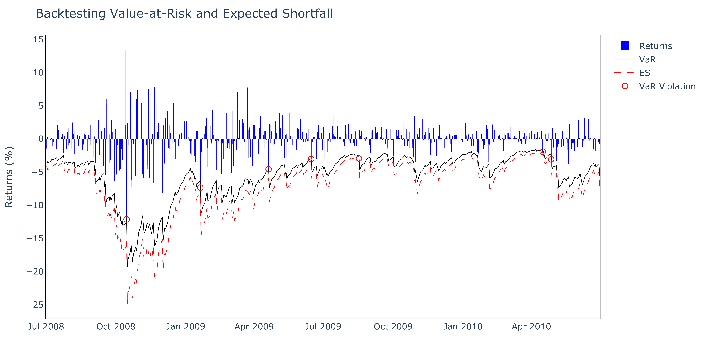

# pyvar: A Modern Toolkit for Financial Risk Management

**Automated Value-at-Risk (VaR) estimation and analysis in Python**  
Simple. Fast. Visual. Intuitive.

---

## 📘 Introduction

Risk management is central to finance, yet many practitioners still rely on inefficient tools like spreadsheets. As programming becomes essential in financial workflows, there is a growing need for accessible, efficient solutions to compute Value-at-Risk (VaR) and other risk metrics.

**pyvar** is a Python package that automates the full VaR estimation pipeline—from portfolio creation to risk metrics, visualization, backtesting, and even natural language interpretation using LLMs.

> Designed for equity portfolios and simple models, pyvar prioritizes **speed**, **clarity**, and **ease of use**—ideal for professionals, students, and retail investors seeking modern tools for intuitive financial risk modeling.

---

## 🧠 Overview

- Compute and visualize Value-at-Risk (VaR) for equity portfolios
- Use historical, parametric, and Monte Carlo simulation methods
- Plot interactive graphs and export high-quality figures
- Backtest and evaluate risk estimates
- Leverage LLMs for interpreting model results (experimental)
- Built with `numpy`, `pandas`, `plotly`, `statsmodels`, `yfinance`, and more

---

## 📂 Repository Structure

```plaintext
pyvar/
├── package/           ← installable Python package (contains `pyvar/`)
├── examples/          ← Jupyter notebooks demonstrating usage, and a practical example to calculate your portfolio risk
├── docs/              ← theory, documentation, explanation
├── llm/               ← experimental natural language extensions
├── README.md          ← this file
├── LICENSE            ← project license (MIT)
```

---

## 📈 Example Output

Below is an example of one of our volatility models — the GJR-GARCH (from the GARCH family). It shows Value-at-Risk (VaR), Expected Shortfall (ES), and their backtesting results on a subset of the data.



---

## 🚀 Installation

Install pyvar directly from GitHub using pip:

```bash
pip install git+https://github.com/Alessandro-Dodon/pyvar.git#subdirectory=package
```

This command:
- Installs the latest version of the package
- Automatically pulls required dependencies
- Works with Python 3.7 or newer

---

## 🧑‍💻 User Guide

The `examples/` folder contains a Jupyter notebook that demonstrates how to use the package on real financial data. You can use it as a tutorial or as a template for your own work.
To explore the package and examples locally:

```bash
# Clone the repository
git clone https://github.com/Alessandro-Dodon/pyvar.git
cd pyvar

# (Optional) create a virtual environment
python -m venv myenv
source myenv/bin/activate  # On Windows: myenv\Scripts\activate

# Install the package in editable mode
pip install -e ./package

# Launch the example notebooks
cd examples
jupyter notebook
```

---

## 📧 Contact

Feel free to reach out with any questions or comments.

Email: alessandro.dodon@usi.ch
