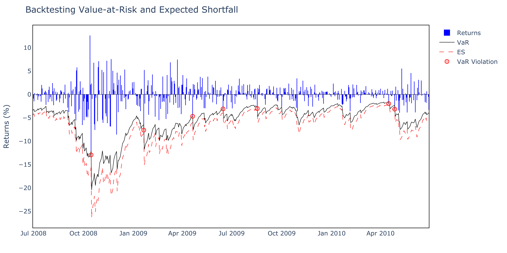
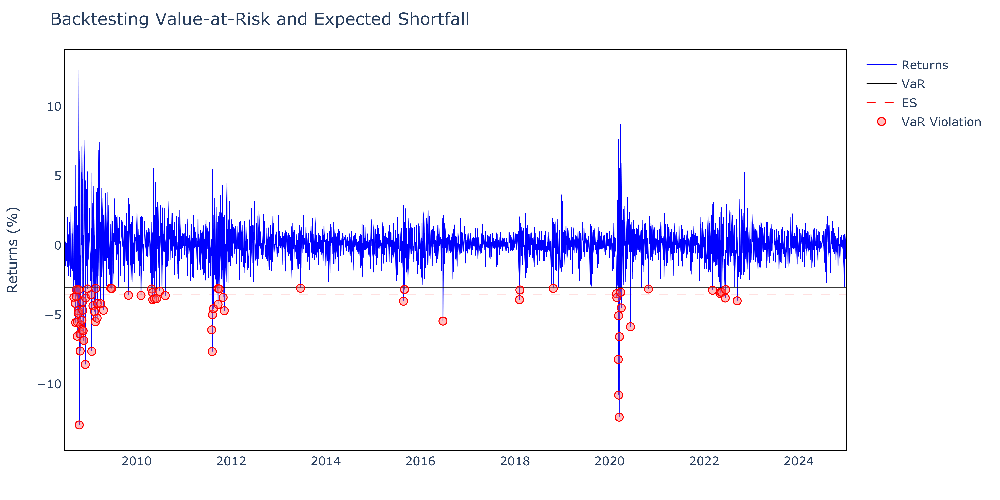
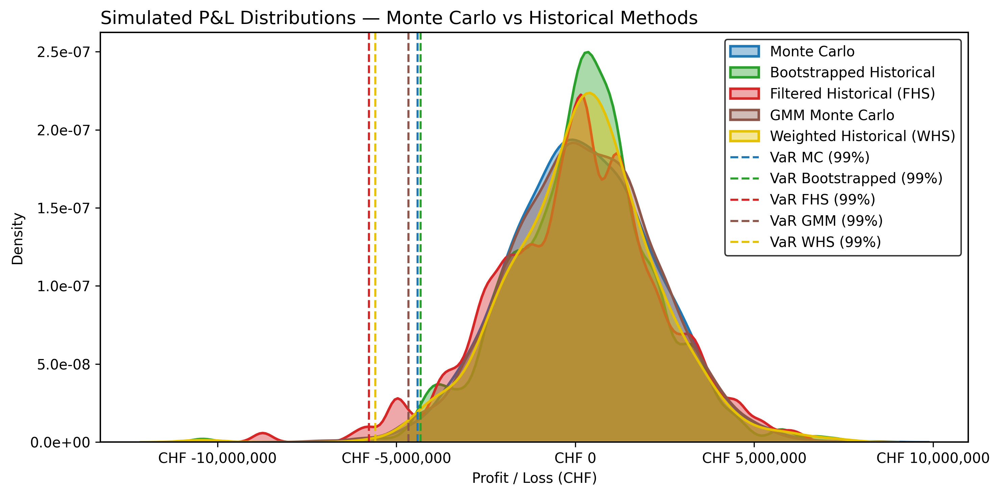
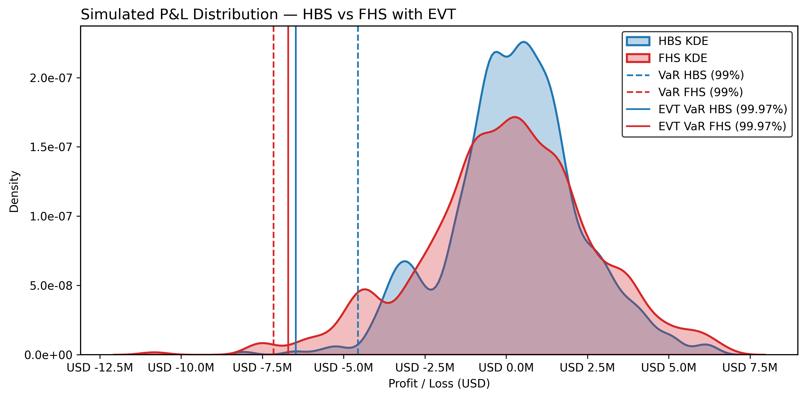
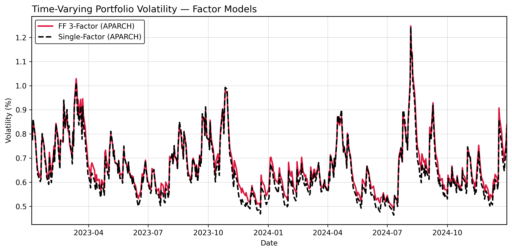
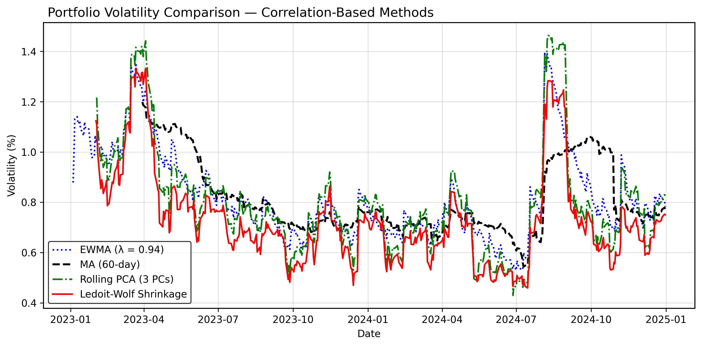
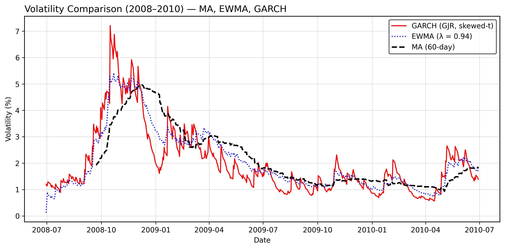

# pyvar: A Modern Toolkit for Market Risk Management

**Automated Value-at-Risk (VaR) estimation and analysis in Python**  
Simple. Fast. Visual. Intuitive.

---

## 📖 Introduction

Risk management is central to finance, yet many practitioners still rely on inefficient tools like spreadsheets. As programming becomes essential in financial workflows, there is a growing need for accessible, efficient solutions to compute market risk metrics such as Value-at-Risk (VaR) and Expected Shortfall (ES).

**pyvar** is a Python package that automates the full VaR estimation pipeline—from portfolio creation to risk metrics, visualization and backtesting.

> Designed for equity and options portfolios, pyvar prioritizes **speed**, **clarity**, and **ease of use**—ideal for professionals, students, and retail investors seeking modern tools for intuitive **market risk** modeling.

---

## 🧠 Overview

- Compute and visualize Value-at-Risk (VaR) for equity and options portfolios
- Use historical, parametric, and various simulation-based methods
- Plot interactive graphs and export high-quality figures
- Backtest and evaluate risk estimates
- Built with `numpy`, `pandas`, `plotly`, `statsmodels`, `yfinance`, and more

---

## 📂 Repository Structure

```plaintext
pyvar/
├── package/           ← installable Python package (contains `pyvar/`)
├── examples/          ← Jupyter notebooks demonstrating usage
├── plots/             ← generated figures illustrating results from the notebooks
├── docs/              ← theory, documentation, explanation
├── README.md          ← this file
├── LICENSE            ← project license (MIT)
```

---

## 📈 Example Outputs

Below are selected plots generated by the notebooks in the `examples/` folder. 

- **Volatility Models – GJR-GARCH VaR**  
  VaR, ES, and backtesting results using the GJR-GARCH model with skewed Student-t innovations, applied to a subset of the data:  
  

- **Parametric Models – Normal VaR**  
  VaR, ES, and backtesting results computed under the parametric normal distribution assumption:  
  

- **Simulation Models - Comparison**  
  Comparison of simulation methods for estimating VaR in a portfolio with significant derivatives exposure:  
  

- **Extreme Value Theory (EVT) - Application**  
  Tail risk modeling using EVT applied to simulated P&L data from an options-heavy portfolio:  
  

- **Factor Models - Comparison**  
  Estimation of portfolio volatility using factor models:  
  

- **Time-Varying Correlations - Comparison**  
  Portfolio volatility estimation using models for time-varying correlations:  
  

- **Volatility Models - Comparison**  
  Asset volatility estimation using different volatility models:  
  

---

## 🚀 Installation

Install pyvar directly from GitHub using pip:

```bash
pip install git+https://github.com/Alessandro-Dodon/pyvar.git#subdirectory=package
```

This command:
- Installs the latest version of the package
- Automatically pulls required dependencies
- Works with Python 3.7 or newer


---

## 🧑‍💻 User Guide

The `examples/` folder contains multiple Jupyter notebooks that demonstrate how to use the package on real financial data. You can use them as tutorials or templates for your own work.

To explore the package and run the example locally, follow these steps:

1. Clone the repository:
```bash
git clone https://github.com/Alessandro-Dodon/pyvar.git
cd pyvar
```

2. _(Optional)_ Install the package in editable mode (for development):
```bash
pip install -e ./package
```

3. _(Optional)_ Launch the example notebooks:
```bash
cd examples
jupyter notebook
```

---

## 📧 Contact

Feel free to reach out with any questions or comments.

Email: alessandro.dodon@usi.ch
